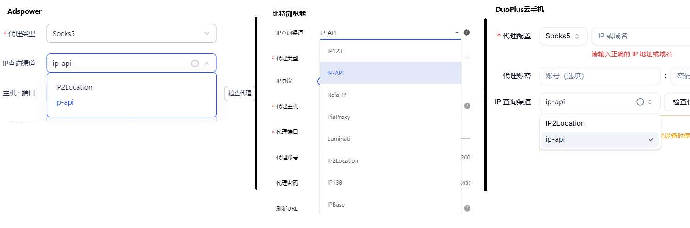

# 为什么查询IP出来的定位不准确？

#### 一、如果您是使用第三方ip查询网站进行查询出现IP归属地有误的情况

因市面上有成千上万家IP查询网站，<mark style="color:red;">**并不是每家的信息更新都是最及时最准确的**</mark>，甚至有些网站已经停更多年仍然在搜索引擎有收录，IP查询请尽量以比较权威和信息更新较快的网站为准，推荐使用[<kbd>ipinfo.io</kbd>](https://ipinfo.io)、[<kbd>ip-api.com</kbd>](https://ip-api.com)查询。 并且每个IP库在城市维度都有自己定位标准，所以**不影响使用**。

***

#### 二、如果您是使用指纹浏览器或云手机检测代理时IP归属地有误的情况

通常指纹浏览器或云手机他们会提供多个IP查询渠道，并不是每个IP查询渠道的信息更新都是最及时最准确的，所以您可以尝试<mark style="color:red;">**切换IP查询渠道**</mark>后再次点击检测。

[^*以上是部分示例，如果没有您正在用的指纹浏览器/云手机，可以咨询指纹浏览器/云手机的客服协助您处理]: 

