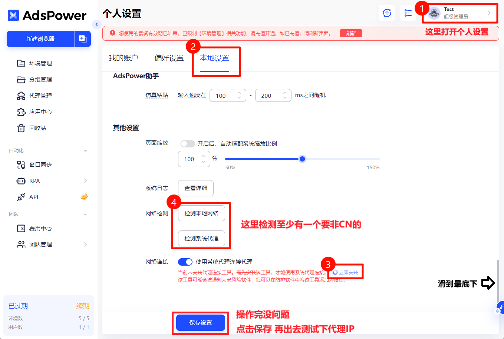
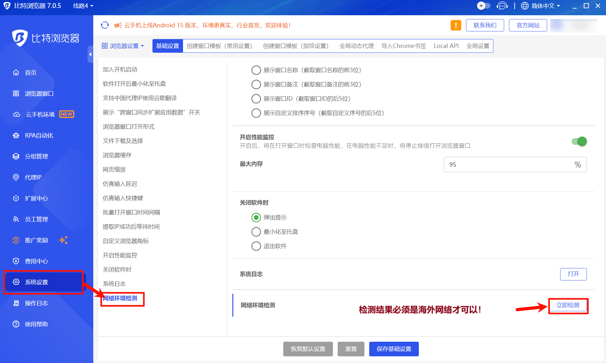

# 为什么连接不成功？（电脑用户）

一、海外IP代理服务需要您具备全局的**海外网络**环境，如果您正在使用网络加速工具请开启**全局模式**（一般的网速加速工具都会有tun模式，或者虚拟网卡设置，开启即可变成全局）并**尝试切换网络节点**，如有不懂之处可以联系您所使用的网络加速工具提供商协助处理（[<mark style="color:red;">👉</mark>](https://help.ipfoxy.net/docs/ru-he-jian-cha-ben-di-wang-luo)[<mark style="color:red;">可以点此查看网络检测教程</mark>](https://help.ipfoxy.net/docs/ru-he-jian-cha-ben-di-wang-luo)）

***

注意：代理信息由4个部分组成，分别由代理主机，端口号，代理账号以及代理密码，信息缺一不可，否则也会连接失败。

二、如果您使用的是**Adspower浏览器**，您的网络加速工具，请开启全局后，可以参考以下方式设置让其自动识别您的海外网络

三、如果您用的是**比特浏览器**，请在比特以下位置检查当前网络是否是非CN的网络，需要非CN的网络才能连上代理，如显示CN网络，用请您的网络加速工具后再检查。

