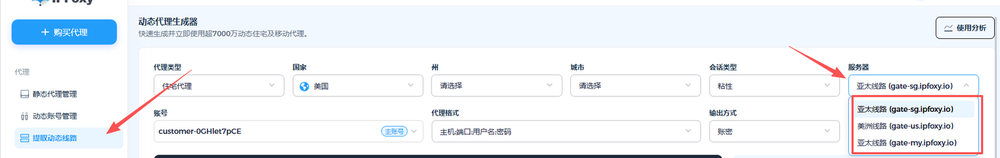

# IP使用的时候网速慢怎么办？

### 静态代理

#### 常见情况

通常IP带宽范围是**2-10mbps之间（**<mark style="color:red;">**数据中心最高5mbps，静态住宅最高10mbps**</mark>**），您可以自行用了代理的浏览器去访问fast.com测试网速，如果是在2到10mbps这个范围内是正常的**，如果网速慢可以减少窗口的打开，或切换网络加速工具的节点并排查海外网络速度，一般本地使用香港，新加坡，马来西亚等地区的节点速度会更快。

#### 东南亚/海外用户

如果您身处海外（并处于以下地区：越南、柬埔寨、泰国、马来西亚、印度尼西亚、缅甸、菲律宾、老挝），请参考如下教程切换加速线路：[👉点我查看处理方案](https://help.ipfoxy.net/docs/ru-he-wei-dai-li-pei-zhi-zhong-zhuan)

***

#### 动态代理

如果您是使用动态较慢可尝试更换动态线路重新提取代理，如果还比较慢且您又选择了州，城市这些可以信息的话，您可以把州和城市去掉，只留国家再重新提取去使用

