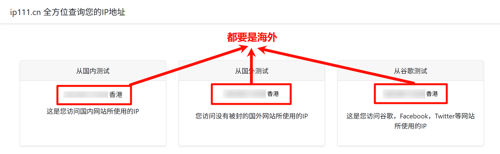

# 为什么无法购买？

#### 情况说明

海外IP代理服务需要您具备全局的<mark style="color:red;">**海外网络**</mark>环境，如果您正在使用网络加速工具请开启<mark style="color:red;">**全局模式**</mark>并<mark style="color:red;">**尝试切换网络节点**</mark>，如有不懂之处可以**联系您所使用的网络加速工具提供商**协助处理

#### 如何查看本地网络是否处于全局海外

可以打开[<kbd>https://ip111.cn/</kbd>](https://ip111.cn/) 查看三个查询结果是否处于海外

